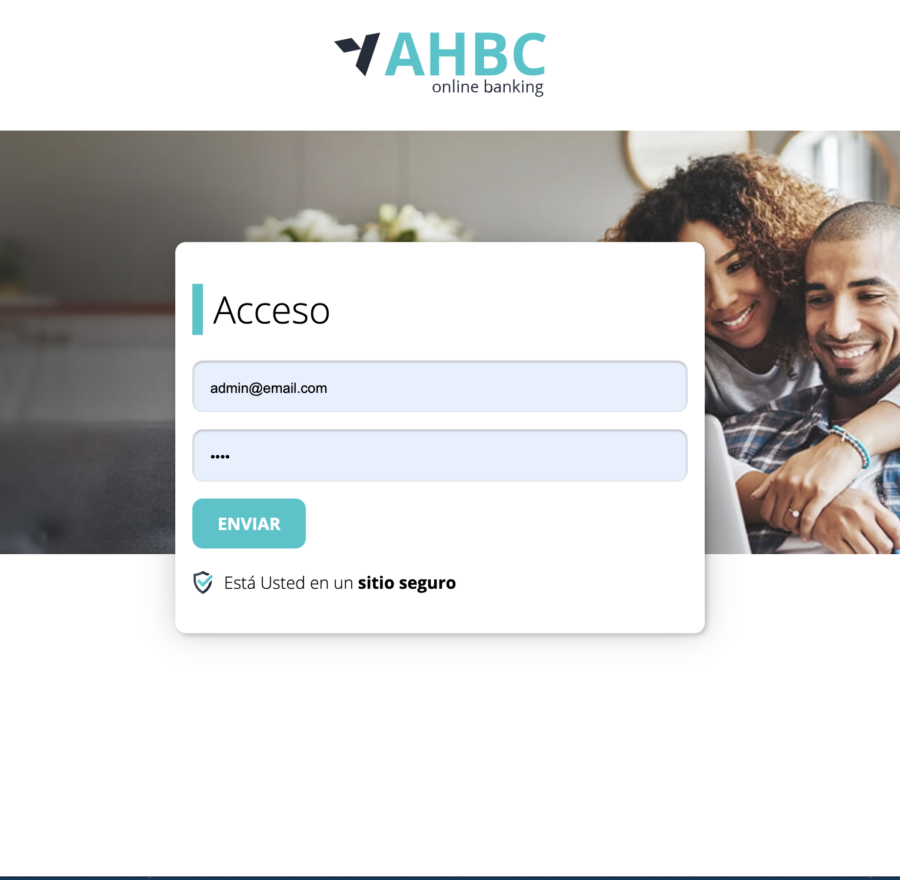
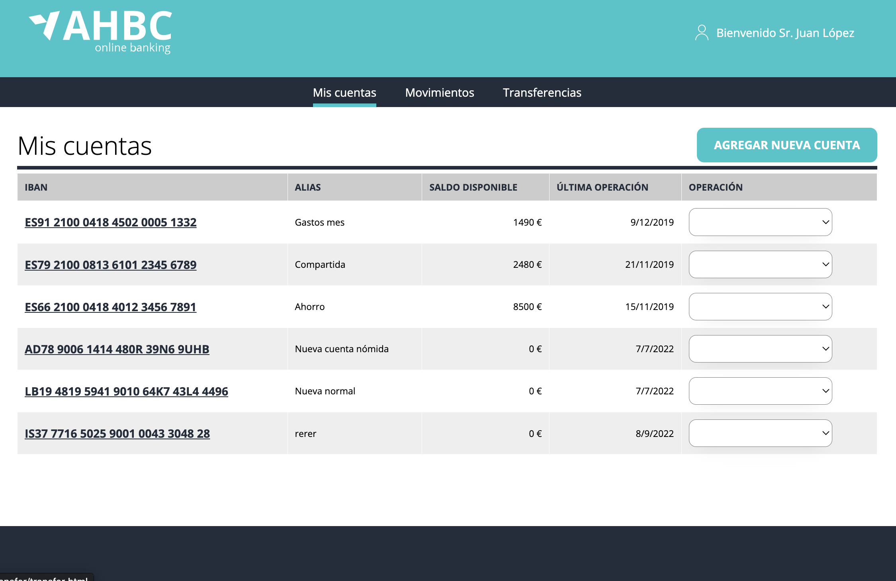
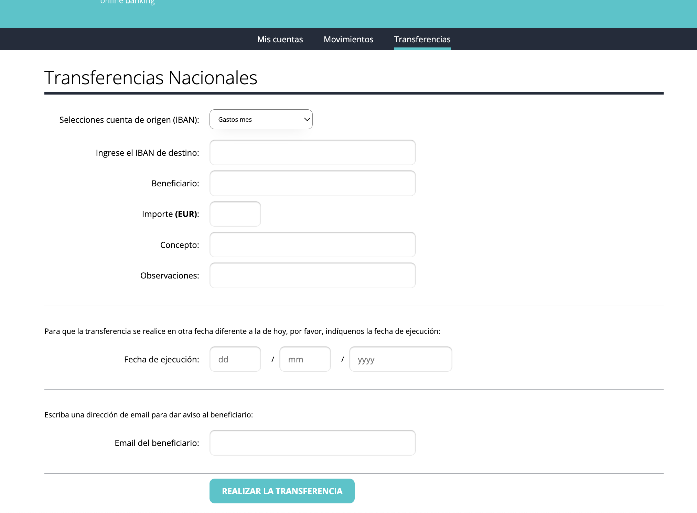
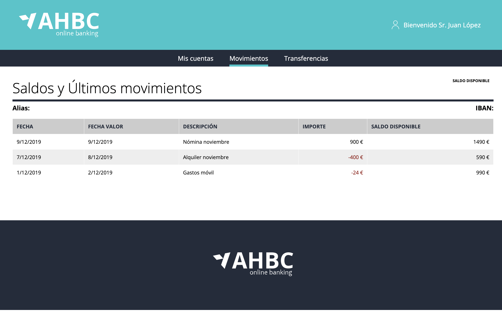

# Online Bank

This project has been developed with Html, CSS and Javascript

First it has a login page username:admin@admin.com and password:test

It has a mocked Json server that display all different bank accounts in the account-list page.

Besides listing the bank accounts, it also has a form to create transactions between banka accounts.

Also display movements details that you can edit and change.

The call and the post are made with Axios.

All inputs has validation to handle errors and empty values.
